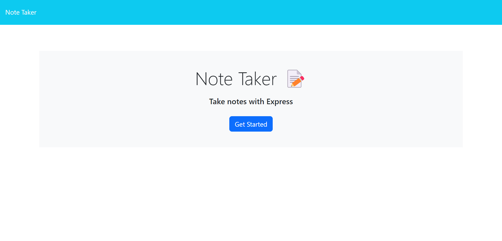
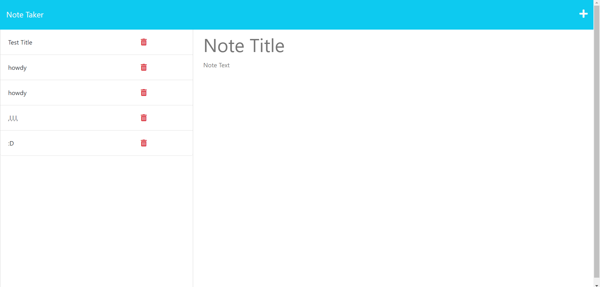

# MakeNote

## Table of Contents
- [Description](#description)
- [Installation](#installation)
- [Usage](#usage)

## Description
MakeNote is a note taking web application. You can create and delete notes of your own choosing. Useful to keep and track and work or related school notes.

## Installation
[MakeNote](makenote-8e1f30a2db71.herokuapp.com/notes)

## Usage
Once your on the main landing page, click 'Get Started'. Now you can type in the Note Title and content fields and write your note. If you wish to save your note, click the save icon on the top right. You can view other saved notes on the left sidebar. If you want to create a new note, click the plus icon on the top right.

